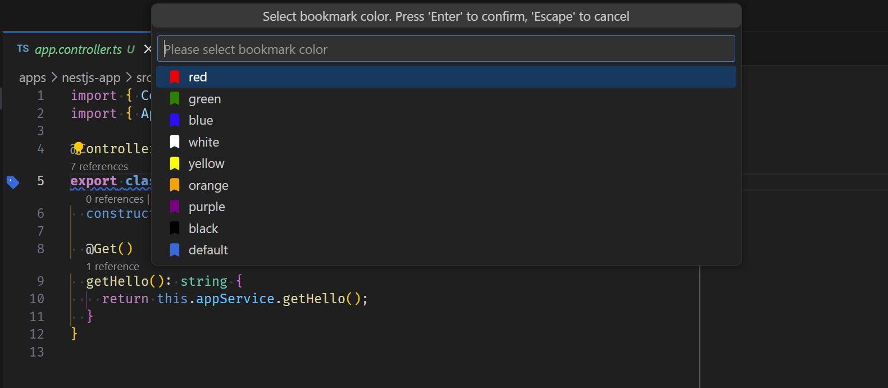
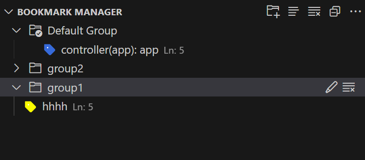

# Bookmark Manager

- [英文](./README.md)

## 功能

- 单行书签切换
- 选中内容设置标签
- 自定义书签样式以及文本装饰器颜色
- 书签管理视图
- 快速跳转预览书签
- 自定义书签备注
- 分组自定义

### 预览

- 总览

- 管理视图

- 可选多种颜色

- 悬浮时显示书签详情

- 文件预览

- 分组自定义

## 插件配置

- `bookmark-manager.alwaysUseDefaultColor`：始终使用默认颜色来装饰书签图标。
- `bookmark-manager.showGutterInOverviewRuler`: 是否在概览标尺上显示 `Gutter` 图标。
- `bookmark-manager.showTextDecoration`: 设置是否显示书签的文本装饰器。
- `bookmark-manager.showGutterIcon`: 是否显示`gutter`图标。
- `bookmark-manager.fontWeight`：书签字体样式。
- `bookmark-manager.colors`：内置颜色和用户定义的书签颜色。
- `bookmark-manager.defaultBookmarkIconColor`：设置默认书签颜色。
- `bookmark-manager.showBorder`: 是否显示边框。
- `bookmark-manager.border`：书签边框样式。
- `bookmark-manager.showOutline`: 是否显示书签的轮廓。
- `bookmark-manager.outline`：书签大纲样式。
- `bookmark-manager.wholeLine`: 是否选择整行，默认选择有内容的区域。
- `bookmark-manager.textDecorationLine`：自定义书签的装饰器风格。
- `bookmark-manager.textDecorationStyle`：自定义书签的装饰器风格。
- `bookmark-manager.outlitextDecorationThicknessne`：自定义装饰的厚度。
- `bookmark-manager.lineBlame`：为书签启用 `lineBlame`。
- `bookmark-manager.enableClick`：启用点击跳转到书签位置。
- ....

## 命令

- `bookmark-manager.toggleLineBookmark`：切换行书签。
- `bookmark-manager.toggleLineBookmarkWithLabel`：使用标签切换行书签。
- `bookmark-manager.toggleLineBookmarkWithColor`：用颜色切换行书签。
- `bookmark-manager.toggleBookmarkWithSelection`：切换书签与选择。
- `bookmark-manager.editDescription`：编辑书签的描述。
- `bookmark-manager.clearAllBookmarksInCurrentFile`：清除打开文件中的所有书签。
- `bookmark-manager.changeBookmarkColor`：更改所选书签的颜色。
- `bookmark-manager.clearAllBookmarks`：清除所有书签。
- `bookmark-manager.deleteBookmark`：删除选定的书签。
- `bookmark-manager.editLabel`：编辑所选书签的标签。
- `bookmark-manager.gotoSourceLocation`：跳转到书签的位置。
- `bookmark-manager.quickJumpTo`：快速跳转。
- `bookmark-manager.openInEditor`：在编辑器中打开。 **WIP**
- `bookmark-manager.listBookmarksInCurrentFile`：列出当前文件中的书签。
- ...

## 注意

- 当在对行或者选择的区域添加书签后,如果开启了 `bookmark-manager.showGutterIcon`, 会出现无法直接设置断点的情况, 不过可以通过使用右键行号进行创建, 更多详情[VSCode issus#5923](https://github.com/Microsoft/vscode/issues/5923)

- ⚒️注意，目前代码重构时存在书签信息异常的问题。

**Enjoy!**
