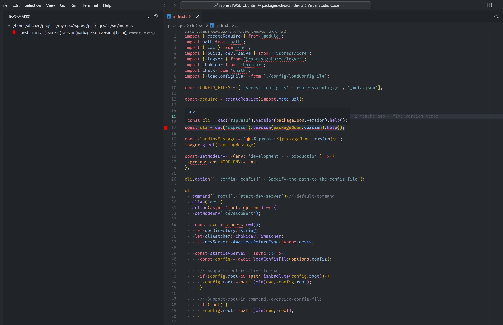

# bookmarks

## Features

- 单行书签切换
- 选中内容设置标签
- 自定义书签样式以及文本装饰器颜色
- 书签管理视图
- 快速跳转预览书签
- 自定义书签备注

## Extension Settings

This extension contributes the following settings:

- `bookmarks.alwaysUseDefaultColor`: 一直使用默认的颜色装饰书签图标
- `bookmarks.showGutterInOverviewRuler`: 是否在概览尺上显示`Gutter`图标.
- `bookmarks.showTextDecoration`: 设置是否显示书签的文本装饰器.
- `bookmarks.showGutterIcon`: 是否显示`gutter`图标.
- `bookmarks.fontWeight`: 书签字体样式.
- `bookmarks.colors`: 内置的颜色以及用户自定义书签颜色.
- `bookmarks.defaultBookmarkIconColor`: 设置默认的书签颜色.
- `bookmarks.showBorder`: 是否显示边框
- `bookmarks.border`: 书签的边框样式
- `bookmarks.showOutline`: 是否显示书签的轮廓
- `bookmarks.outline`: 书签的轮廓样式
- `bookmarks.wholeLine`: 是否选择整行,默认时选择有内容区域
- `bookmarks.textDecorationLine`: 自定义书签的装饰器样式
- `bookmarks.textDecorationStyle`: 自定义书签的装饰器样式
- `bookmarks.outlitextDecorationThicknessne`: 自定义装饰的粗细
- `bookmarks.lineBlame`: 开启书签的 `lineBlame`

**Enjoy!**
