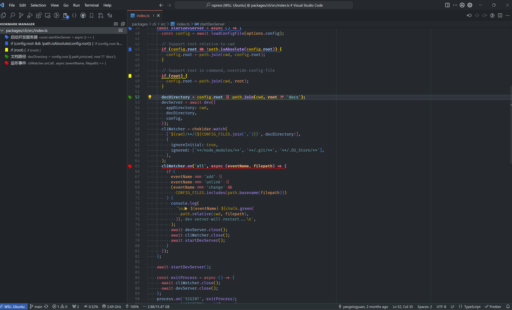

# Bookmark Manager

- [中文](./README-ZN.md)

## Features

- Single line bookmark switching
- Select the Content Settings tab
- Customize bookmark style and text decorator color
- Bookmark management view
- Quickly jump to preview bookmarks
- Customized bookmark notes

### Preview

1.  Sidebar bookmark management

2.  Bookmark multi-color classification management

3. Bookmark selection

4. Quickly preview bookmarks and jump to their location

## Configuration

- `bookmark-manager.alwaysUseDefaultColor`: Always use the default color to decorate the bookmark icon
- `bookmark-manager.showGutterInOverviewRuler`: Whether to display the `Gutter` icon on the overview ruler.
- `bookmark-manager.showTextDecoration`: Set whether to display the bookmark's text decorator.
- `bookmark-manager.showGutterIcon`: Whether to display the `gutter` icon.
- `bookmark-manager.fontWeight`: Bookmark font style.
- `bookmark-manager.colors`: built-in colors and user-defined bookmark colors.
- `bookmark-manager.defaultBookmarkIconColor`: Set the default bookmark color.
- `bookmark-manager.showBorder`: whether to display the border
- `bookmark-manager.border`: Bookmark border style
- `bookmark-manager.showOutline`: whether to display the outline of the bookmark
- `bookmark-manager.outline`: bookmark outline style
- `bookmark-manager.wholeLine`: Whether to select the entire line, by default the area with content is selected
- `bookmark-manager.textDecorationLine`: Customize the decorator style of bookmarks
- `bookmark-manager.textDecorationStyle`: Customize the decorator style of bookmarks
- `bookmark-manager.outlitextDecorationThicknessne`: Customize the thickness of the decoration
- `bookmark-manager.lineBlame`: Enable `lineBlame` for bookmarks

## Other

## Attention

After adding a bookmark to a line or selected area, if `bookmark-manager.showGutterIcon` is turned on, you will not be able to set a breakpoint directly. However, you can create one by right-clicking on the line number. For more details [VSCode issus# 5923](https://github.com/Microsoft/vscode/issues/5923)

**Enjoy!**
