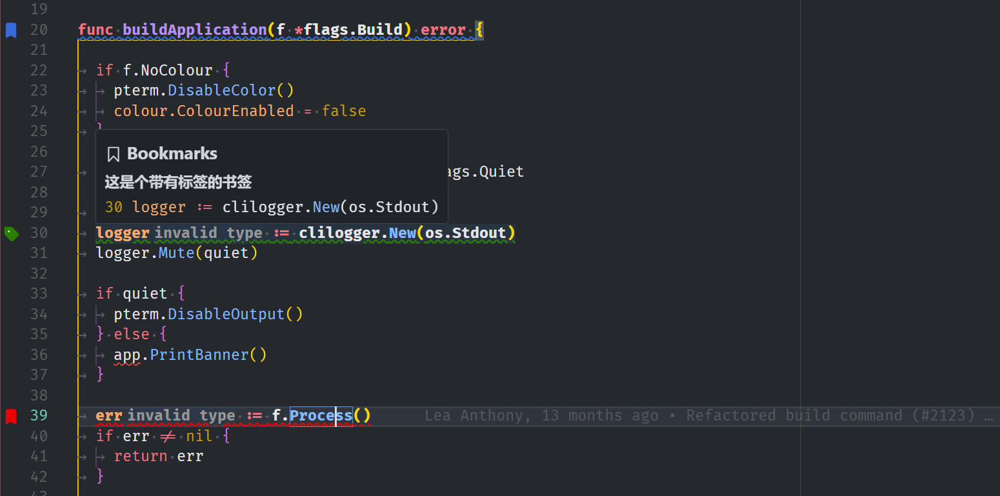

# Bookmark Manager

- [中文](./README-ZN.md)

## Features

- Toggle line bookmark
- Toggle bookmark with selection
- Customize bookmark style and text decorator color
- Bookmark management view
- Quickly jump to preview bookmarks
- Customized bookmark notes

### Preview

- Overview
  
- Sidebar bookmark management

- Bookmark multi-color classification management

- Bookmark selection

- Quickly preview bookmarks and jump to their location

- The floating prompt displays bookmark information

- Display an overview list of bookmarks

## Configuration

- `bookmark-manager.alwaysUseDefaultColor`: Always use the default color to decorate the bookmark icon.
- `bookmark-manager.showGutterInOverviewRuler`: Whether to display the `Gutter` icon on the overview ruler.
- `bookmark-manager.showTextDecoration`: Set whether to display the bookmark's text decorator.
- `bookmark-manager.showGutterIcon`: Whether to display the `gutter` icon.
- `bookmark-manager.fontWeight`: Bookmark font style.
- `bookmark-manager.colors`: built-in colors and user-defined bookmark colors.
- `bookmark-manager.defaultBookmarkIconColor`: Set the default bookmark color.
- `bookmark-manager.showBorder`: whether to display the border.
- `bookmark-manager.border`: Bookmark border style.
- `bookmark-manager.showOutline`: whether to display the outline of the bookmark.
- `bookmark-manager.outline`: bookmark outline style.
- `bookmark-manager.wholeLine`: Whether to select the entire line, by default the area with content is selected.
- `bookmark-manager.textDecorationLine`: Customize the decorator style of bookmarks.
- `bookmark-manager.textDecorationStyle`: Customize the decorator style of bookmarks.
- `bookmark-manager.outlitextDecorationThicknessne`: Customize the thickness of the decoration.
- `bookmark-manager.lineBlame`: Enable `lineBlame` for bookmarks.
- `bookmark-manager.enableClick`: Enable click to jump to bookmark location.

### Commands

- `bookmark-manager.toggleLineBookmark`: Toggle line bookmark.
- `bookmark-manager.toggleLineBookmarkWithLabel`: Toggle line bookmark with label.
- `bookmark-manager.toggleLineBookmarkWithColor`: Toggle line bookmark with color.
- `bookmark-manager.toggleBookmarkWithSelection`: Toggle Bookmark with selection.
- `bookmark-manager.editDescription`: Editing the description of a bookmark.
- `bookmark-manager.clearAllBookmarksInCurrentFile`: Clear all bookmar in opened file.
- `bookmark-manager.changeBookmarkColor`: Change the color of the selected bookmark.
- `bookmark-manager.clearAllBookmarks`: Clear all bookmarks.
- `bookmark-manager.deleteBookmark`: Delete selected bookmark.
- `bookmark-manager.editLabel`: Edit the label of the selected bookmark.
- `bookmark-manager.gotoSourceLocation`: Jump to the location of the bookmark.
- `bookmark-manager.quickJumpTo`: Quick jump.
- `bookmark-manager.openInEditor`: Open in editor. **WIP**
- `bookmark-manager.listBookmarksInCurrentFile`: List bookmarks in current file.
- ....

## Attention

- After adding a bookmark to a line or selected area, if `bookmark-manager.showGutterIcon` is turned on, you will not be able to set a breakpoint directly. However, you can create one by right-clicking on the line number. For more details [VSCode issus# 5923](https://github.com/Microsoft/vscode/issues/5923)
- ⚒️ Note that there is currently a problem of abnormal bookmark information when the code is refactored.

  **Enjoy!**
